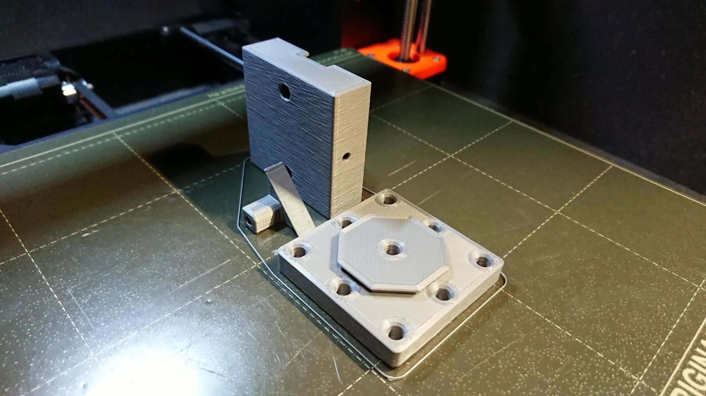
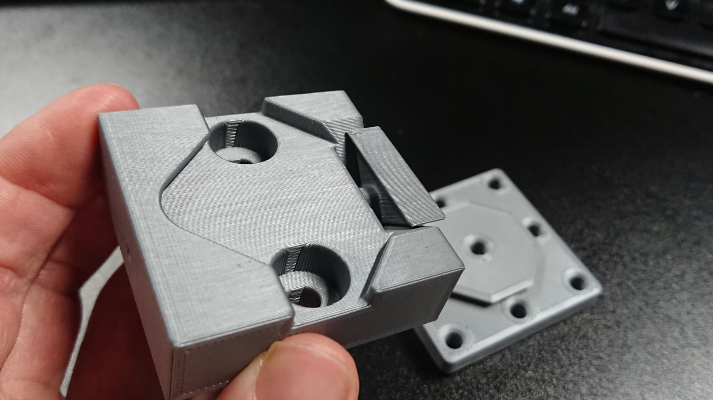
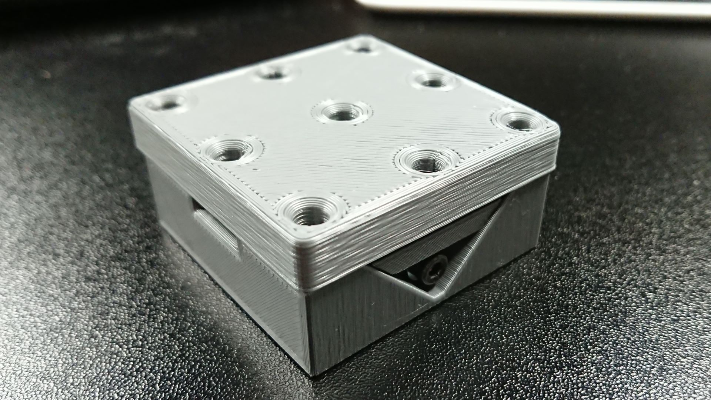
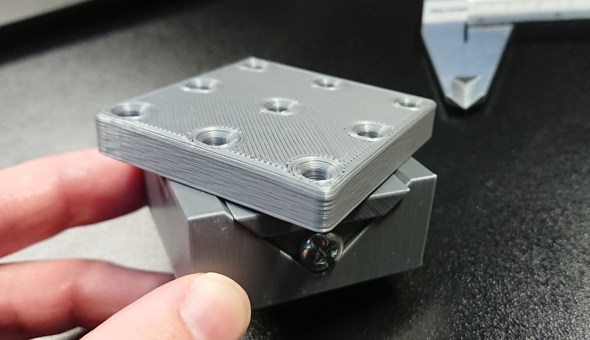
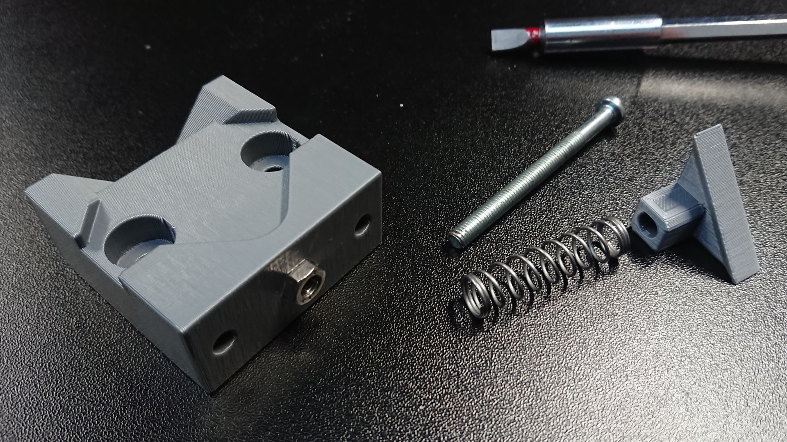

# Fabricatable-Clamp
A machining vise and toolholder combo

### February 26th, 2024

*First sketch with a trademarked name, ehm*

*First test print*

*The clamp with octagonal dovetail in the background*

*First test assembled with test toolboard*

*Second test showing 45 deg clmaping*

*Second test parts including spring and a long M5 screw*

**BOM first test:**

 - M5 screw 60mm long with threads covering at least half of the screw length
 - 2x M5 nuts
 - A spring of 6-8mm diameter
 - Filament for FDM printing
 
 **Results from firsts tests**
 
 - Promising
 - Rotational rigidity seems insufficient
