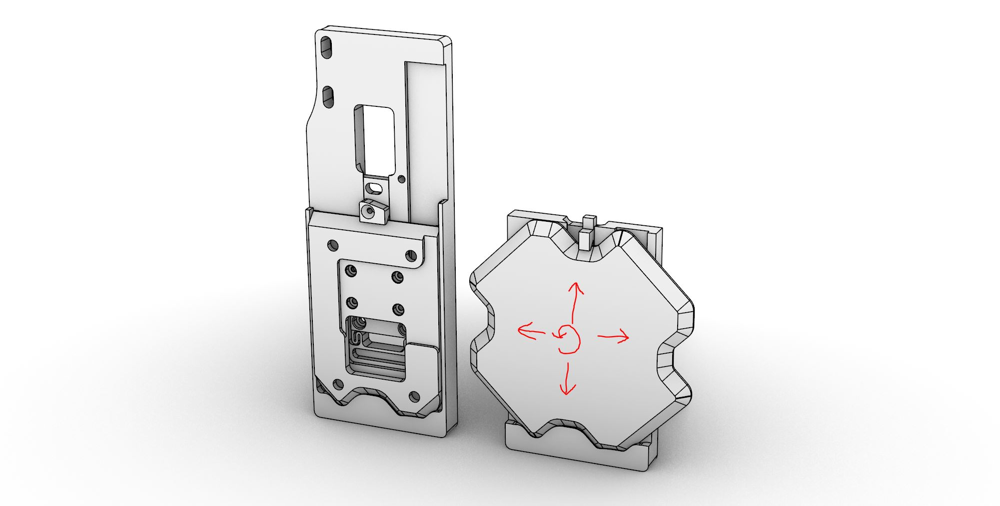
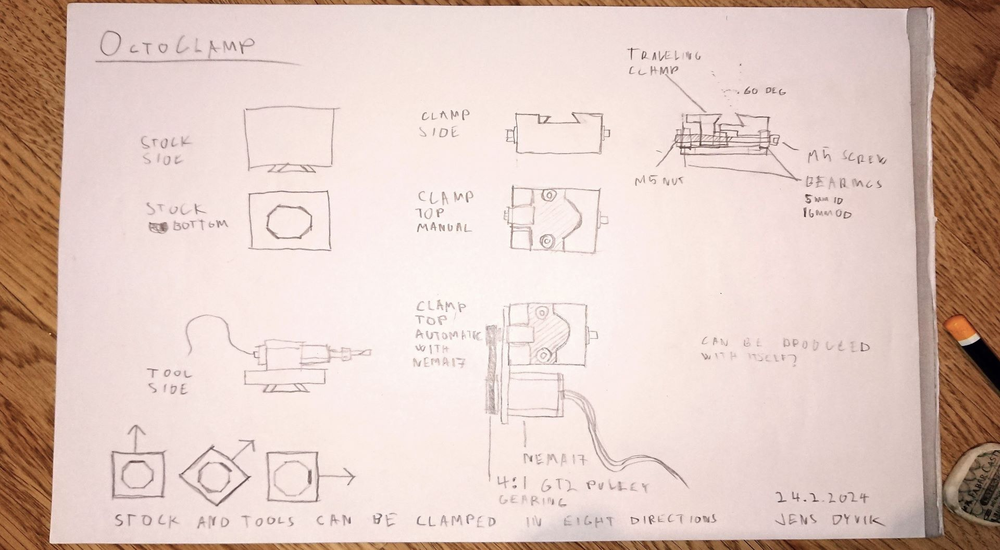

### March 7th 2024

Exploring the possibility of hacking Jake Read's [Kleat](https://clank.tools/tools/) tool changer system to work in four directions instead of developing my own. Jakes's original left and hacked version right. Looks promising and it is very valuable to share standard geometries for designs.

### February 26th 2024

Sketches and quick test of a combo CNC machining stock holder and tool holder inspired by Jake Read's [Kleat](https://clank.tools/tools/) tool changer system and various dovetail clamping systems in the CNC industry.

*First sketch with a trademarked name, ehm*

*First test print*

*The clamp with octagonal dovetail in the background*

*First test assembled with test toolboard*

*Second test showing 45 deg clmaping*

*Second test parts including spring and a long M5 screw*

**BOM first test:**

 - M5 screw 60mm long with threads covering at least half of the screw length
 - 2x M5 nuts
 - A spring of 6-8mm diameter
 - Filament for FDM printing
 
 **Results from firsts tests**
 
 - Promising
 - Rotational rigidity seems insufficient
